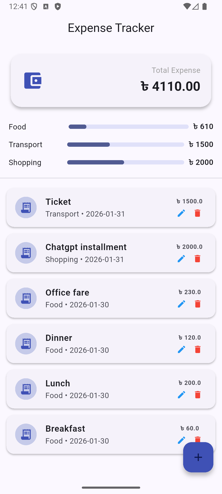

# 💸 Expense Tracker App (Flutter)

<p align="center">
  
  
  
  
  
</p>

A **modern, finance‑grade Expense Tracker application** built with **Flutter**, following **MVVM architecture**, **Provider state management**, and **SQLite (sqflite)** for reliable local data persistence.

This project is designed as a **portfolio‑ready and production‑quality foundation** for:

* Personal finance apps
* HRMS expense modules
* Enterprise budgeting solutions

---

## 📸 App Preview

<p align="center">
  
</p>

---

## ✨ Highlights

* Clean & modern finance dashboard UI
* Category‑wise analytics with visual indicators
* Offline‑first architecture using local database
* Scalable MVVM structure suitable for large apps
* Beginner‑friendly yet industry‑standard codebase

---

## 🚀 Features

* ✅ Add, edit, and delete expenses
* ✅ Category‑wise expense tracking
* ✅ Category‑wise totals with progress analytics
* ✅ Overall expense summary dashboard
* ✅ Persistent local storage using SQLite
* ✅ Clean MVVM architecture
* ✅ Provider‑based state management
* ✅ Safe delete with confirmation dialog
* ✅ Modern, professional UI/UX

---

## 🏗 Architecture Overview

The application follows the **MVVM (Model–View–ViewModel)** pattern:

```text
UI (View)
   ↓
ViewModel (State + Business Logic)
   ↓
Model (Data Layer)
   ↓
SQLite Database
```

### Why MVVM?

* 🔹 Clear separation of concerns
* 🔹 Easy to maintain and scale
* 🔹 Test‑friendly structure
* 🔹 Widely used in real‑world Flutter applications

---

## 📁 Project Structure

```text
lib/
 ├─ model/
 │   └─ expense_model.dart
 │
 ├─ db/
 │   └─ expense_db.dart
 │
 ├─ viewmodel/
 │   └─ expense_view_model.dart
 │
 ├─ view/
 │   ├─ expense_home_page.dart
 │   ├─ add_expense_page.dart
 │   └─ edit_expense_page.dart
 │
 └─ main.dart
```

---

## 🧱 Tech Stack

| Layer            | Technology           |
| ---------------- | -------------------- |
| UI               | Flutter (Material 3) |
| State Management | Provider             |
| Architecture     | MVVM                 |
| Local Database   | SQLite (sqflite)     |
| Language         | Dart                 |

---

## 📦 Dependencies

```yaml
dependencies:
  flutter:
    sdk: flutter
  provider: ^6.1.2
  sqflite: ^2.3.0
  path: ^1.9.0
```

---

## 💾 Database Schema

```sql
CREATE TABLE expenses (
  id INTEGER PRIMARY KEY AUTOINCREMENT,
  title TEXT,
  amount REAL,
  category TEXT,
  date TEXT
);
```

---

## 🧠 Core Concepts Used

* ChangeNotifier & `notifyListeners()`
* Provider (`watch` / `read`) pattern
* SQLite CRUD operations
* MVVM best practices
* Clean UI–logic separation
* Confirmation dialogs for destructive actions

---

## ▶️ Getting Started

### 1️⃣ Clone the repository

```bash
git clone https://github.com/Robiul13/expense-tracker-flutter.git
```

### 2️⃣ Install dependencies

```bash
flutter pub get
```

### 3️⃣ Run the app

```bash
flutter run
```

> ⚠️ If you change the database schema, **uninstall the app and run again** to recreate the local database.

---

## 🔮 Future Enhancements

* 📊 Pie / Bar charts for expense analytics
* 📅 Monthly & yearly filtering
* 🏷 Custom categories
* 📤 Export to PDF / Excel
* ☁️ Cloud sync (Firebase)
* ⚡ Riverpod implementation
* 🧪 Unit & widget tests

---

## 👨‍💻 Author

**Md. Robiul Islam**
Flutter & Backend Developer
📍 Bangladesh

---

## 📄 License

This project is open‑source and available under the **MIT License**.

---

## ⭐ Support & Contribution

If you find this project useful:

* ⭐ Star the repository
* 🍴 Fork it
* 🐛 Report issues
* 💡 Suggest improvements

Contributions and feedback are always welcome 🙌
