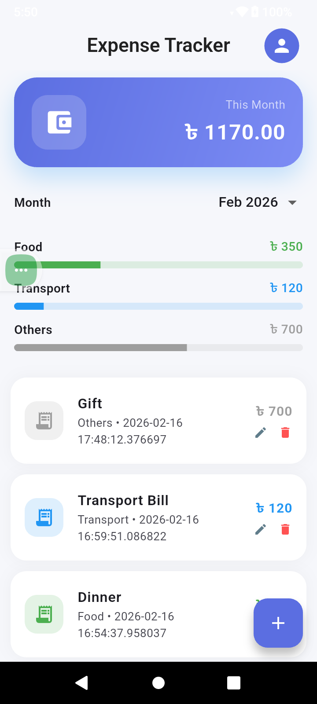

---

# 💸 Expense Tracker App (Flutter)

<p align="center">
  
  
  
  
  
  
  
</p>

A **modern, finance-grade Expense Tracker application** built with **Flutter**, following **MVVM architecture**, **Provider state management**, and a powerful **Hybrid Database architecture (SQLite + Supabase Cloud Sync)**.

This project demonstrates a **production-ready offline-first system** where:

* Data is stored locally (SQLite)
* Automatically synced to cloud (Supabase)
* Fully authenticated user-based access
* Secure and scalable architecture

---

## 📸 App Preview 
<p align="center">
 
</p> 

---
# 🚀 Key Features

### 🔐 Authentication (Supabase)

* Email & Password login
* Secure session handling
* Auth error mapping
* Professional state management

### 💾 Hybrid Database System

* SQLite (Local persistence)
* Supabase (Cloud storage)
* Auto sync when internet available
* Unsynced queue handling
* Offline-first support

### 📊 Expense Management

* Add / Edit / Delete expenses
* Category-based analytics
* Monthly filtering
* Progress indicators
* Modern dashboard UI

### 🧠 Architecture

* MVVM (Model–View–ViewModel)
* Repository Pattern
* Hybrid Repository (Local + Remote)
* Clean separation of concerns
* Production-grade state handling

---

# 🏗 Architecture Overview

```text
UI (View)
   ↓
ViewModel (Business Logic)
   ↓
Hybrid Repository
   ↓              ↓
SQLite (Local)   Supabase (Cloud)
```

### Why Hybrid?

✔ Works fully offline
✔ Syncs automatically when online
✔ Enterprise scalable
✔ Finance-app ready

---

# 📁 Project Structure

```text
lib/
 ├─ auth/
 │   ├─ auth_provider.dart
 │   ├─ auth_service.dart
 │   ├─ login_page.dart
 │   └─ register_page.dart
 │
 ├─ core/
 │   └─ category_colors.dart
 │
 ├─ db/
 │   ├─ expense_db.dart
 │   └─ hybrid_expense_repository.dart
 │
 ├─ model/
 │   └─ expense_model.dart
 │
 ├─ view/
 │   ├─ expense_home_page.dart
 │   ├─ add_expense_page.dart
 │   └─ edit_expense_page.dart
 │
 ├─ viewmodel/
 │   └─ expense_view_model.dart
 │
 └─ main.dart
```

---

# 🧱 Tech Stack

| Layer        | Technology           |
| ------------ | -------------------- |
| UI           | Flutter (Material 3) |
| State        | Provider             |
| Architecture | MVVM + Repository    |
| Local DB     | SQLite (sqflite)     |
| Cloud        | Supabase             |
| Connectivity | connectivity_plus    |
| Language     | Dart                 |

---

# 📦 Dependencies

```yaml
dependencies:
  flutter:
    sdk: flutter
  provider: ^6.1.2
  sqflite: ^2.3.0
  path: ^1.9.0
  supabase_flutter: ^2.x.x
  connectivity_plus: ^5.x.x
```

---

# 💾 Database Schema (Cloud - Supabase)

```sql
CREATE TABLE expenses (
  id uuid PRIMARY KEY,
  user_id uuid REFERENCES auth.users(id),
  title text,
  amount numeric,
  category text,
  created_at timestamptz default now(),
  updated_at timestamptz,
  is_synced boolean default false
);
```

---

# 🔒 Row Level Security (RLS)

```sql
CREATE POLICY "Users can view own expenses"
ON expenses
FOR SELECT
USING (auth.uid() = user_id);
```

✔ Each user can only access their own data
✔ Production-grade security

---

# 🧠 Core Concepts Used

* ChangeNotifier
* Provider (watch / read)
* Supabase Auth
* SQLite CRUD
* Hybrid Sync Strategy
* Offline-first Architecture
* Professional Error Handling
* RLS Policies
* Production-ready folder structure

---

# ▶️ Getting Started

### 1️⃣ Clone repository

```bash
git clone https://github.com/Robiul13/expense_tracker.git
```

---

### 2️⃣ Install packages

```bash
flutter pub get
```

---

### 3️⃣ Configure Supabase

Create `.env` file:

```env
SUPABASE_URL=your_project_url
SUPABASE_ANON_KEY=your_anon_key
```

---

### 4️⃣ Run app

```bash
flutter run
```

---

# 🔮 Roadmap / Future Enhancements

* 📊 Charts (Pie / Bar)
* 🔁 Auto background sync
* ☁️ Realtime sync
* 📤 Export to PDF / Excel
* 🌍 Multi-currency
* 🌙 Dark mode
* 🔐 Biometric authentication
* 🧪 Unit & integration tests
* 🚀 CI/CD pipeline

---

# 👨‍💻 Author

**Md. Robiul Islam**
Flutter & Backend Developer
📍 Bangladesh

---

# 📄 License

MIT License

---

# ⭐ Support

If you like this project:

* ⭐ Star the repo
* 🍴 Fork it
* 🐛 Open issues
* 💡 Suggest improvements

---
